# SolaX Cloud MCP - Architecture & How It Works

This document describes the internal architecture, data flows, and design patterns of the SolaX Cloud MCP server.

## Table of Contents

1. [System Overview](#system-overview)
2. [Component Architecture](#component-architecture)
3. [Authentication Flow](#authentication-flow)
4. [Data Flow](#data-flow)
5. [Rate Limiting](#rate-limiting)
6. [Response Shaping](#response-shaping)
7. [Error Handling](#error-handling)
8. [Deployment Architecture](#deployment-architecture)

---

## System Overview

The SolaX Cloud MCP server is a unified bridge between the SolaX Developer Platform API and two distinct consumption interfaces:

1. **MCP Mode (stdio)**: Protocol-based interface for Claude Desktop / Claude Code
2. **HTTP Mode**: RESTful interface for containerized deployment on Raspberry Pi

The server is transport-agnostic — the core business logic (authentication, API calls, response shaping) is shared between both modes.

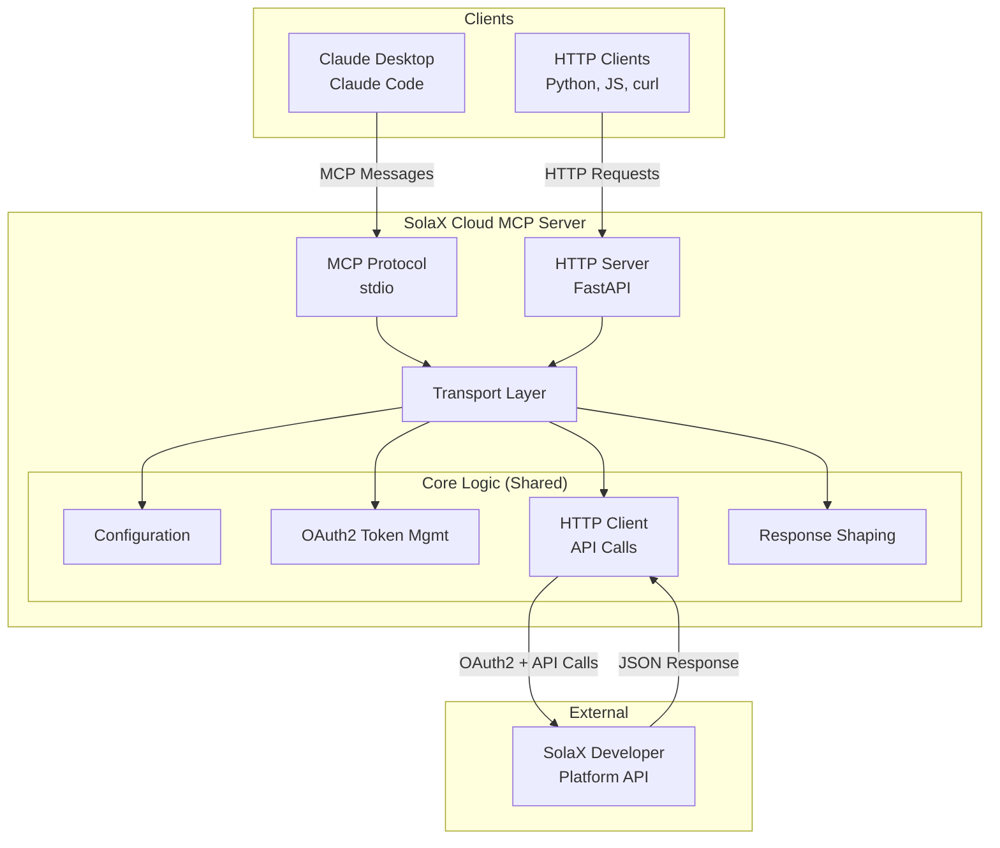

---

## Component Architecture

### Component Diagram

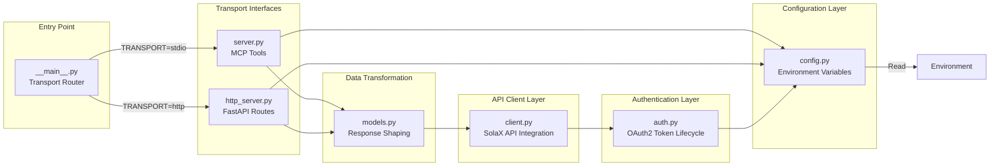

### File Structure

```
src/solax_cloud_mcp/
├── __main__.py          # Entry point: routes to MCP or HTTP based on TRANSPORT env var
├── __init__.py          # Package metadata
├── config.py            # Environment variable loading & validation
├── auth.py              # OAuth2 token lifecycle (fetch, cache, refresh, invalidate)
├── client.py            # SolaX API HTTP client (realtime data, battery control, rate limiting)
├── models.py            # Response shaping (normalize, decode status codes, group fields)
├── server.py            # MCP tools & shared business logic
└── http_server.py       # FastAPI HTTP server & routes
```

---

## Authentication Flow

### OAuth2 Token Lifecycle

The server uses **client credentials** OAuth2 flow to obtain access tokens from SolaX.

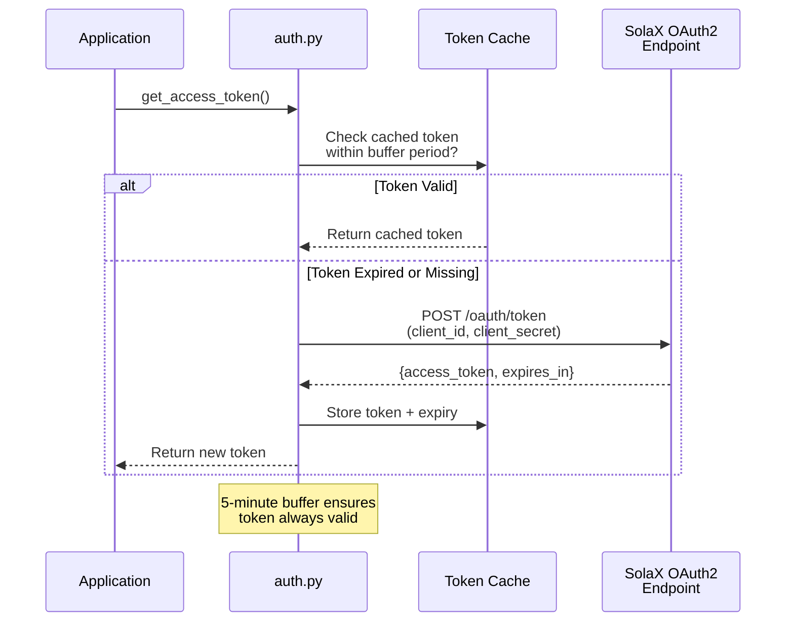

**Key Features:**

- **Token Caching**: Tokens are cached in memory and reused until expiry
- **Expiry Buffer**: 300-second (5-minute) buffer prevents edge-case token expiry during requests
- **Thread-Safe**: `asyncio.Lock()` ensures only one thread can refresh concurrently
- **Automatic Retry**: On 10402 (auth failure), the client automatically invalidates the cached token and retries once

### Credentials

Credentials are loaded from environment variables at startup:

```python
SOLAX_CLIENT_ID      # OAuth2 Client ID (required)
SOLAX_CLIENT_SECRET  # OAuth2 Client Secret (required)
SOLAX_DEVICE_SN      # Device serial number (optional, used as default)
```

---

## Data Flow

### Query Flow: Get Real-Time Data

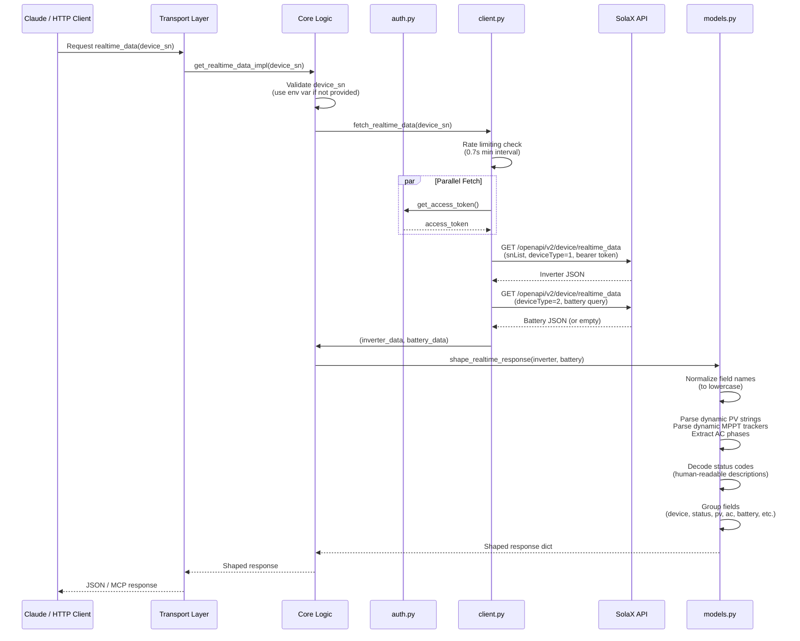

### Control Flow: Set Battery Mode

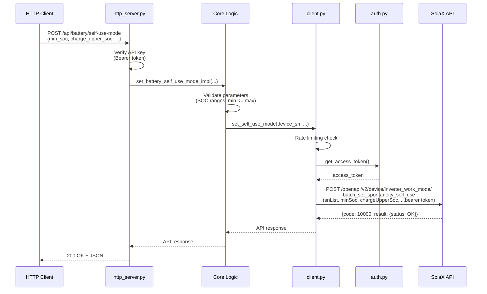

---

## Rate Limiting

The server implements **soft rate limiting** to respect SolaX API quotas.

### Rate Limit Strategy

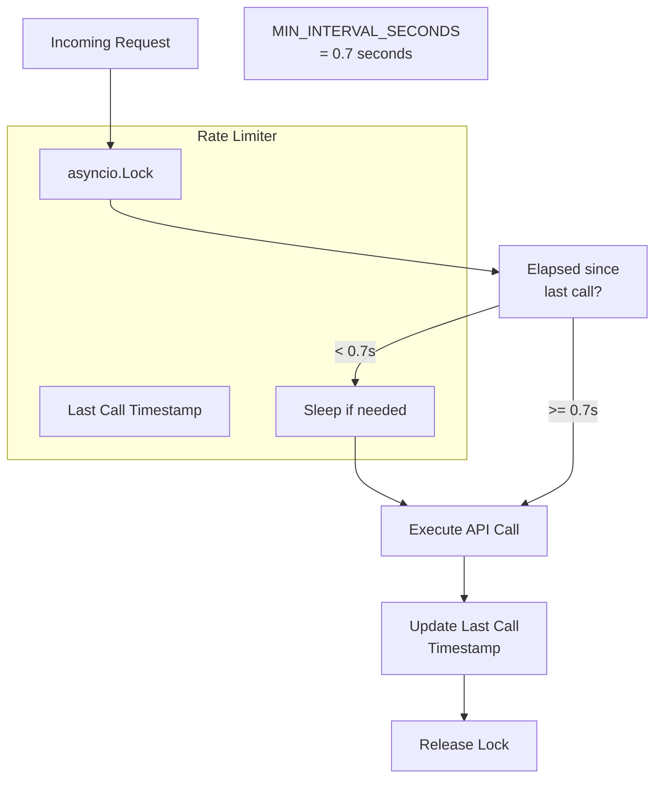

**Configuration:**

- **Minimum Interval**: 0.7 seconds between API calls
- **Justification**: SolaX allows 100 calls/minute; 0.7s = 85-86 calls/minute (conservative buffer)
- **Enforcement**: Global `asyncio.Lock()` ensures thread-safe enforcement
- **Coverage**: Applied to both `fetch_realtime_data()` and `set_self_use_mode()`

**Behavior:**

```python
# If you make 3 requests immediately:
# Request 1: 0ms elapsed → execute immediately
# Request 2: happens at +0ms → sleep 0.7s, then execute at +0.7s
# Request 3: happens at +0.7ms → sleep 0.7s, then execute at +1.4s
```

---

## Response Shaping

The raw SolaX API response is complex and inconsistent. The response shaper transforms it into a clean, human-friendly structure.

### Normalization Pipeline

```mermaid
graph LR
    Raw["Raw API Response<br/>(mixed casing,<br/>flat structure)"]
    
    Normalize["1. Normalize<br/>Keys to lowercase"]
    DynPV["2. Parse Dynamic<br/>PV Strings<br/>(pv1voltage,<br/>pv2voltage, ...)"]
    DynMPPT["3. Parse Dynamic<br/>MPPT Trackers<br/>(mppt1voltage, ...)"]
    ExtractPhases["4. Extract AC Phases<br/>(3-phase fixed)"]
    DecodeStatus["5. Decode Status Codes<br/>(to human-readable)"]
    GroupFields["6. Group Fields<br/>(device, pv, ac,<br/>battery, etc.)"]
    
    Shaped["Shaped Response<br/>(clean, grouped,<br/>decoded)"]
    
    Raw --> Normalize
    Normalize --> DynPV
    DynPV --> DynMPPT
    DynMPPT --> ExtractPhases
    ExtractPhases --> DecodeStatus
    DecodeStatus --> GroupFields
    GroupFields --> Shaped
```

### Example Transformation

**Raw Response (from API):**
```json
{
  "deviceSn": "X3ABCD0123",
  "deviceStatus": 102,
  "pv1voltage": 421.7,
  "pv1current": 5.2,
  "pv1power": 2189.0,
  "pv2voltage": 418.0,
  "pv2current": 4.8,
  "pv2power": 2006.4,
  "acvoltage1": 224.1,
  "accurrent1": 18.2,
  "acpower1": 4078.0,
  ...
}
```

**Shaped Response:**
```json
{
  "device": {
    "deviceSn": "X3ABCD0123",
    "registerNo": "SE123456SP",
    ...
  },
  "status": {
    "code": 102,
    "description": "Normal"
  },
  "pv": [
    {"string": 1, "voltage_V": 421.7, "current_A": 5.2, "power_W": 2189.0},
    {"string": 2, "voltage_V": 418.0, "current_A": 4.8, "power_W": 2006.4}
  ],
  "ac": {
    "phases": [
      {"phase": 1, "voltage_V": 224.1, "current_A": 18.2, "power_W": 4078.0, ...}
    ],
    ...
  },
  ...
}
```

### Key Transformations

1. **Field Case Normalization**: Convert all keys to lowercase for consistent access
2. **Dynamic Parsing**: PV strings and MPPT trackers are variable-count; parser extracts indices and builds arrays
3. **Status Decoding**: Integer status codes (e.g., 102) are mapped to human-readable descriptions (e.g., "Normal")
4. **Logical Grouping**: Related fields are grouped into logical sections (device, pv, ac, battery, etc.)
5. **Unit Notation**: Field names include units (e.g., `voltage_V`, `power_W`) for clarity

---

## Error Handling

### Error Hierarchy

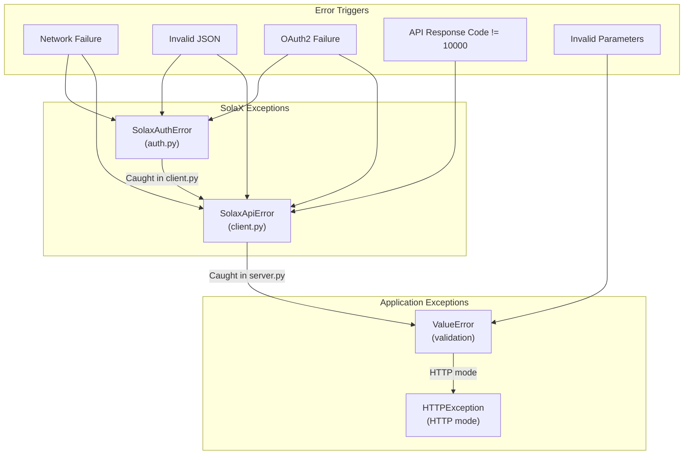

### Automatic Retry Logic

When the API returns **10402 (access_token authentication failed)**:

1. The cached token is invalidated
2. A fresh token is requested
3. The API call is retried once

```python
if code == 10402:
    auth.invalidate_token()          # Clear cache
    token = await auth.get_access_token()  # Fetch new token
    response = await client.get(...)  # Retry request
    code = response.json().get("code")
```

This handles cases where tokens expire between fetch and use, or credentials are briefly invalid.

### HTTP Error Responses

| Status Code | Scenario | Response |
|---|---|---|
| 200 | Success | `{...data...}` or `{code: 10000, result: {...}}` |
| 400 | Bad request (missing device_sn, invalid SOC) | `{detail: "error message"}` |
| 403 | Authentication failure (invalid/missing API key) | `{detail: "Invalid API key"}` |
| 500 | Unhandled server error | `{detail: "..."}` |

---

## Deployment Architecture

### Dual-Transport Architecture

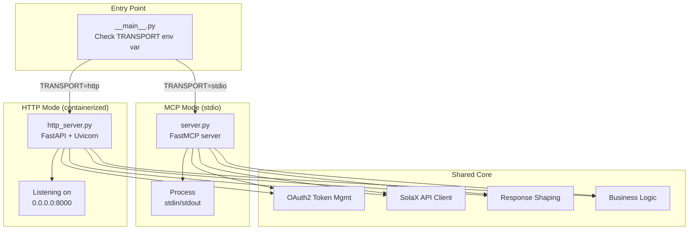

### Container Deployment

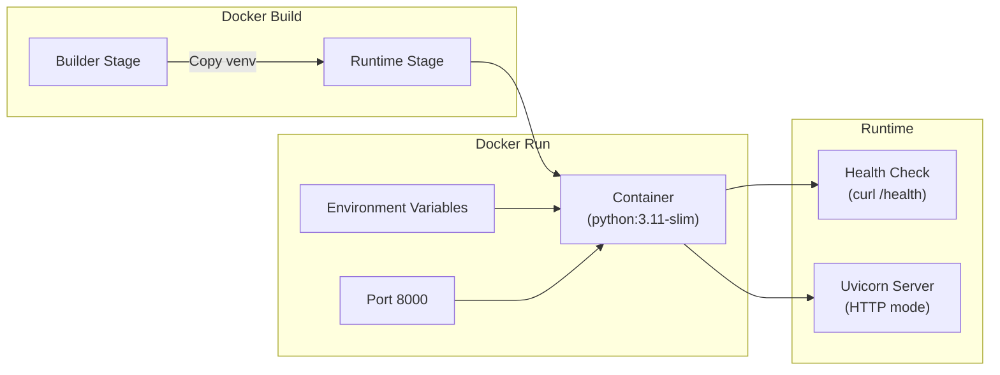

**Multi-stage Build Benefits:**

- Builder stage: installs uv, compiles venv (large)
- Runtime stage: only includes minimal runtime dependencies + venv (small)
- Result: Lean image suitable for Raspberry Pi

---

## Key Design Patterns

### 1. Shared Impl Pattern

Both MCP and HTTP modes use the same **`*_impl()`** functions:

```python
# Shared implementation
async def get_realtime_data_impl(device_sn: str | None = None) -> dict:
    # Business logic here
    ...

# MCP wrapper
@server.tool()
async def get_realtime_data(device_sn: str | None = None) -> dict:
    return await get_realtime_data_impl(device_sn)

# HTTP wrapper
@app.post("/api/realtime-data")
async def get_realtime_data_endpoint(req: RealtimeDataRequest, authorization: str) -> dict:
    verify_api_key(authorization)
    return await get_realtime_data_impl(req.device_sn)
```

**Benefit**: Zero code duplication; business logic evolves in one place.

### 2. Global State with Lock

Token caching uses global state + asyncio.Lock for thread-safe access:

```python
_cached_token: str | None = None
_expires_at: float = 0.0
_auth_lock = asyncio.Lock()

async with _auth_lock:
    if _cached_token and time.monotonic() < _expires_at - BUFFER:
        return _cached_token
    # Otherwise fetch new token
```

**Benefit**: Minimal overhead; single token shared across all concurrent requests.

### 3. Transport-Agnostic Configuration

Configuration is loaded from environment variables, not hardcoded:

```python
SOLAX_CLIENT_ID = os.getenv("SOLAX_CLIENT_ID")
SOLAX_CLIENT_SECRET = os.getenv("SOLAX_CLIENT_SECRET")
SOLAX_DEVICE_SN = os.getenv("SOLAX_DEVICE_SN")
TRANSPORT = os.getenv("TRANSPORT", "stdio")
```

**Benefit**: Same codebase works in Docker, local development, and cloud environments.

### 4. Soft Rate Limiting

Rate limiting is soft — enforced per-process, not globally:

```python
_last_call_at = 0.0
_rate_limit_lock = asyncio.Lock()
MIN_INTERVAL_SECONDS = 0.7
```

**Benefit**: Simple, predictable, no distributed cache required.

---

## Data Consistency & Integrity

### API Call Resilience

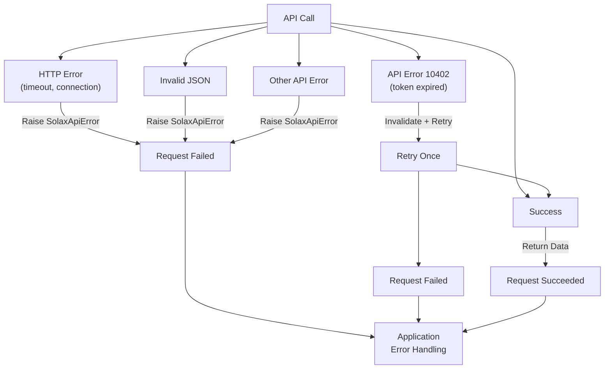

### Battery Data Graceful Degradation

If battery data is unavailable (battery-less system, offline, etc.):

```python
async def fetch_battery_data(device_sn: str) -> dict | None:
    try:
        return await _request_realtime(device_sn, DEVICE_TYPE_BATTERY, ...)
    except SolaxApiError:
        # No battery on this system; return None
        return None
```

The response shaper handles `None`:

```python
battery = None
if battery_result is not None:
    battery = {...build battery object...}
```

Result: `"battery": null` in shaped response (not an error).

---

## Performance Considerations

### Token Caching Impact

- **Without caching**: Every request would require an OAuth2 round-trip (~200ms)
- **With caching**: First request ~200ms, subsequent requests ~0ms (until expiry)
- **Result**: ~100x speedup for typical polling scenarios

### Rate Limiting Impact

- Enforces 0.7s minimum interval between calls
- For 100 calls/minute, roughly 1 call per 0.6 seconds → no breaches with buffer
- Prevents thundering herd and API throttling

### Response Shaping Impact

- Parsing & normalization: ~5-20ms per response
- Acceptable for typical 30-60 second poll intervals
- Only shapes data that will be consumed (lazy where possible)

### Memory Footprint

- Token cache: ~100 bytes per token
- Rate limiter state: ~16 bytes
- Per-request overhead: minimal (async-only, no threads)
- Suitable for Raspberry Pi (256MB+ RAM)

---

## Testing Strategy

### Unit Tests

- `test_config.py`: Environment variable loading
- `test_models.py`: Response shaping, status decoding, dynamic parsing

### Integration Tests

- Manual CLI test: `uv run python -c "...fetch_realtime_data()..."`
- HTTP server test: `curl http://localhost:8000/health`
- Docker test: `docker-compose up -d && curl http://localhost:8000/health`

### Test Coverage

- Edge cases: battery-less devices, null status codes, missing fields
- Error handling: network failures, auth failures, API errors
- Rate limiting: concurrent requests, interval enforcement
- Response shaping: PV string parsing, MPPT parsing, status decoding

---

## Conclusion

The SolaX Cloud MCP server is designed as a **lean, transport-agnostic bridge** between the complex SolaX API and clean consumer interfaces (MCP, HTTP). Key strengths:

- **Shared logic**: Business logic written once, used by both MCP and HTTP
- **Automatic resilience**: Token refresh, retries on auth failure
- **Clean responses**: Complex raw data transformed into intuitive structure
- **Soft rate limiting**: Respects API quotas without external coordination
- **Containerization**: Optimized for Raspberry Pi deployment

The architecture prioritizes simplicity over sophistication — avoiding premature abstraction, caching only what's necessary, and failing fast with clear error messages.
